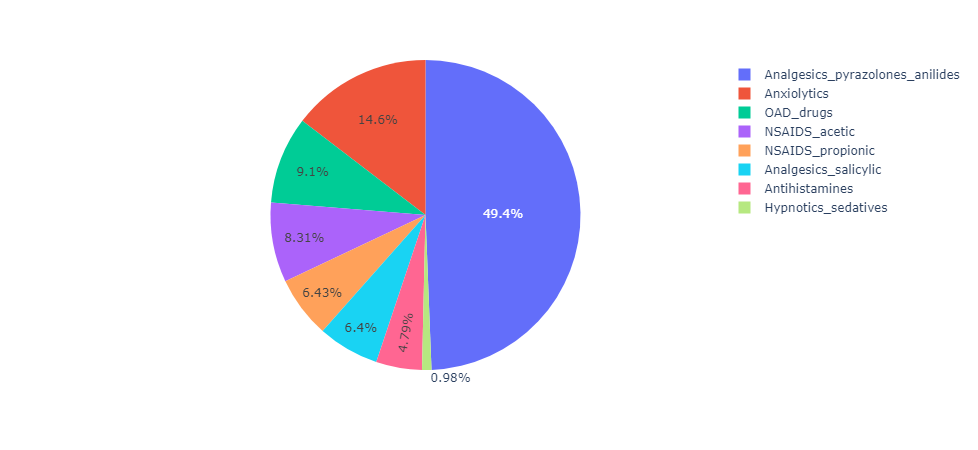
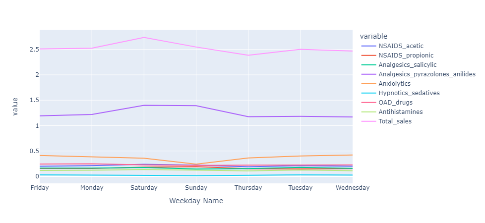
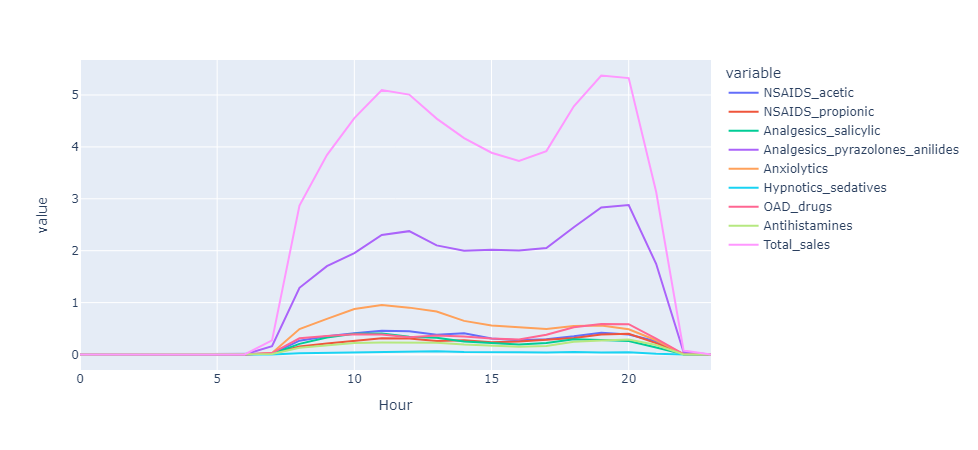
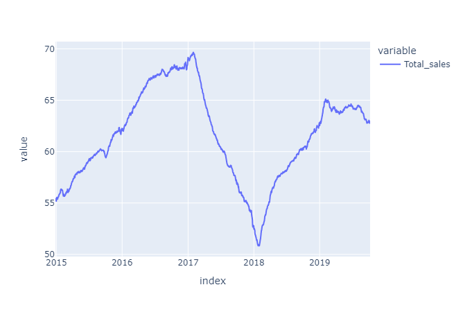
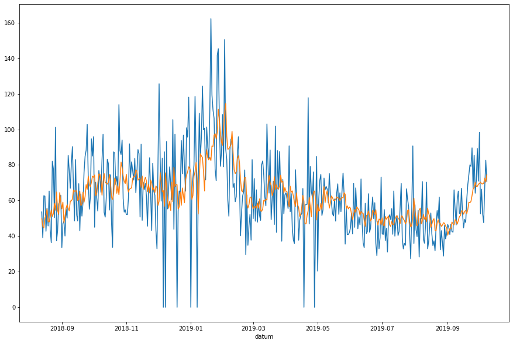

#  Pharmacy sales analysis
In this project I analyize the hourly sales of a pharmacy and extract the insights from the data to improve the sales and also create a time series forcasting model

### Info about the data
The dataset is built from the initial dataset consisted of 600000 transactional data collected in 6 years (period 2014-2019), indicating date and time of sale, pharmaceutical drug brand name and sold quantity, exported from Point-of-Sale system in the individual pharmacy. Selected group of drugs from the dataset (57 drugs) is classified to the following Anatomical Therapeutic Chemical (ATC) Classification System categories:

M01AB - Anti-inflammatory and antirheumatic products, non-steroids, Acetic acid derivatives and related substances
M01AE - Anti-inflammatory and antirheumatic products, non-steroids, Propionic acid derivatives
N02BA - Other analgesics and antipyretics, Salicylic acid and derivatives
N02BE/B - Other analgesics and antipyretics, Pyrazolones and Anilides
N05B - Psycholeptics drugs, Anxiolytic drugs
N05C - Psycholeptics drugs, Hypnotics and sedatives drugs
R03 - Drugs for obstructive airway diseases
R06 - Antihistamines for systemic use
Sales data are resampled to the hourly, daily, weekly and monthly periods. Data is already pre-processed, where processing included outlier detection and treatment and missing data imputation.

### Look at the data 
here I will explore the data by asking some question and answering with a chart
* What is the most selling category of drugs?  
* What are the sales of each category in different weekdays? 
* which hours the pharmacy sales the most? 
* What is the pharmacy sales growth over the years? 

### Forecasting model
I created ARIMA model and tried many configuration to find a decent model, then I used walkforward method to evaluate the method

### Conclusion
From the analysis I can recommend the pharmacy to:
- design the shifts of the employees to ensure that the highest number of employees present from 10 am to 1 pm and from 6 pm to 8 pm, because those are the time with the highest sales
- Pyrazolones and anilides analgesics make about 50 percent of the sales so make sure to have ongoing supply of them
-  January, February, October, November are the months with the highest sales so the pharmacy should be prepared with enough drugs (Especially Pyrazolones and anilides analgesics) 
- There were a sudden decrease in the sales in the year 2017/2018, this should be investigated to fix the problem or maker sure that it will not happen in the future if that is possible
